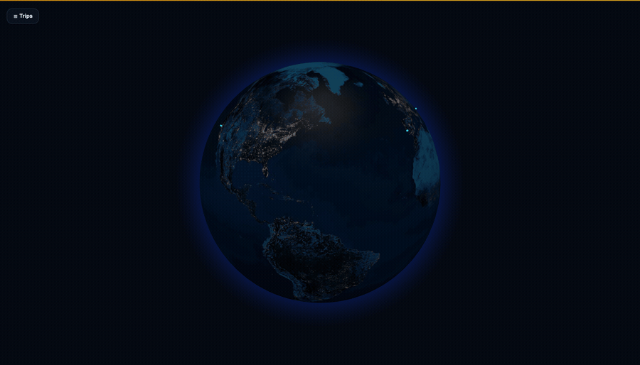
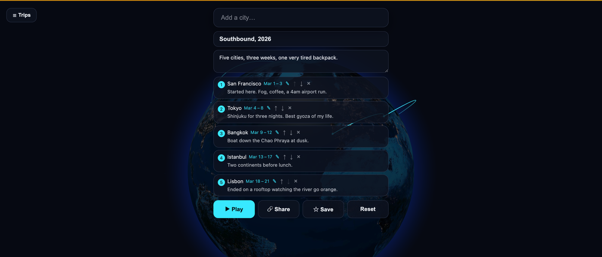
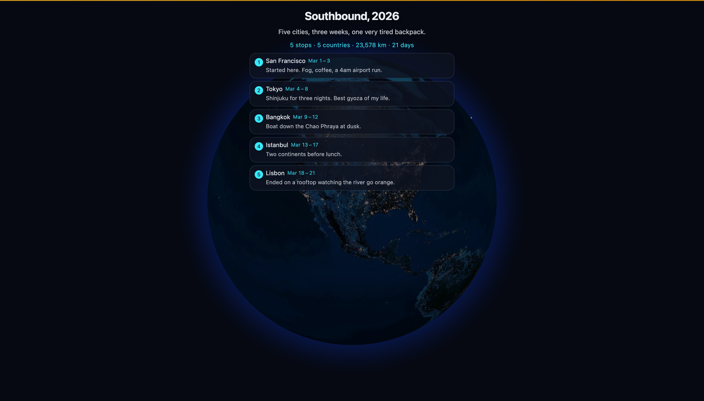

<div align="center">

# Atlas Trails

**Add the cities of a trip, hit play, and watch it fly across a 3D globe.**

Annotate each stop with dates and a note, then share the whole thing as a link.
No account, no install, no backend.

[**Open the live app →**](https://atlas-trails.vercel.app)

[](LICENSE)
[](https://react.dev)
[](https://www.typescriptlang.org)
[](https://vite.dev)
[](https://threejs.org)
[](https://atlas-trails.vercel.app)



</div>

## What it does

Type a few cities, and Atlas Trails draws the route as great-circle arcs across a
night-lit Earth, flying the camera from stop to stop. Give each stop a date range
and a note about what happened there, name the trip, and the whole thing — notes
included — compresses into a URL you can send to anyone.

| Build it | Share it |
|---|---|
|  |  |

- **Search that forgives.** `NYC`, `Bombay`, `Munchen`, `Barcelna`, and
  `Paris, France` all land on the right city.
- **Notes and dates per stop.** A line about what happened, and when you were
  there. Dated trips report their day span alongside distance.
- **Shareable links.** The trip lives in the URL hash, so a link needs no
  database and never expires.
- **A trip library.** Save named trips locally and reload them later.

## How it works

**No backend, by design.** Your working trip autosaves to `localStorage`; named
trips go to a separate library key. Sharing serializes the trip to the URL hash
(`#t=<lz-string>`), so a link carries the entire trip — stops, notes, dates,
title, summary — and works forever with zero infrastructure. Nothing you write
is ever sent to a server.

**The globe** is [`react-globe.gl`](https://github.com/vasturiano/react-globe.gl)
over three.js, lazy-loaded in its own chunk so the ~530 KB gzipped 3D payload
never blocks first paint. Browsers without WebGL get a graceful fallback screen
instead of a blank canvas.

**Cities** come from a bundled, population-sorted GeoNames list
(`public/cities.json`, top 10k) fetched as a static asset — offline, no API key,
no per-keystroke network call. Anything not in that list falls through to
OpenStreetMap Nominatim.

### The search pipeline

Naive prefix matching fails the moment someone types `NYC` or misspells
`Reykjavik`. `searchCities` instead ranks the whole list in tiers and returns the
best six:

| Tier | Matches | Example |
|---|---|---|
| Exact | the normalized name outright | `tokyo` → Tokyo |
| Alias | curated abbreviations and historic names | `NYC`, `Bombay`, `Saigon`, `Peking` |
| Prefix | name starts with the query | `Los Ang` → Los Angeles |
| Word | a later word starts with the query | `york` → New York City |
| Substring | the query appears anywhere | `Angeles` → Los Angeles |
| Fuzzy | bounded edit distance, 1–2 typos | `Barcelna`, `Amsterdm`, `Reykjavic` |

Within a tier the source order wins, and since the source is population-sorted,
the more prominent city ranks first. A few details that matter:

- **Normalization** strips diacritics, apostrophes and punctuation, so `sao`
  reaches São Paulo, `zur` reaches Zürich, and `st louis` reaches St. Louis.
- **Country qualifiers** filter before ranking: `Paris, France`, `Lima Peru`,
  `Cambridge UK`, `San Jose Costa Rica`. A two-letter tail is treated as a guess,
  so `xi an` and `la paz` still resolve when the guess turns out to be part of
  the name.
- **Fuzzy runs last and only when needed** — if the cheaper tiers already fill
  the result list, typo matches are dropped as noise. The edit distance
  abandons a candidate as soon as it exceeds budget, which keeps a full 10k-row
  scan under ~5 ms.
- **Deduping** collapses repeats and the administrative subdivisions GeoNames
  ships beside real cities, so `Paris` returns Paris — not Paris plus five of
  its arrondissements.

Type something the bundled list simply does not have (`Paris TX`, a village, a
mountain) and the app debounces for 600 ms, then geocodes worldwide through
Nominatim, aborting in flight if you keep typing.

### Share links

Notes are capped (140 chars per stop, 200 for the summary) before they are
encoded, so link length stays bounded by stop count rather than by how much
someone typed. A five-stop annotated trip is ~790 characters; twelve stops with
notes on every one is ~1.1 KB.

Every decode is treated as hostile input: `parseStops` drops malformed stops,
rejects non-calendar dates, and discards an end date that precedes its start.
A tampered payload falls back to the empty builder rather than throwing. Links
made before notes existed still open — they simply carry none.

Opening a shared link never overwrites the visitor's own saved trip. It renders
read-only, and "Create your own" restores whatever they had.

## Project map

```
src/
  App.tsx          state, playback wiring, share-link and hash handling
  CommandBar.tsx   search box, stop list, note/date editors, actions
  GlobeCanvas.tsx  react-globe.gl wrapper (lazy-loaded)
  TripsPanel.tsx   saved-trip library
  cities.ts        city loading, the tiered search, Nominatim fallback
  types.ts         Stop/Trip model, validation, trip stats, great-circle math
  share.ts         URL-hash encode/decode
  storage.ts       autosaved working trip
  trips.ts         named trip library
  usePlayback.ts   playback state machine and camera flight
  webgl.ts         capability check
```

## Develop

```bash
npm install
npm run dev      # http://localhost:5173
npm run lint     # oxlint
npm run build    # tsc -b && vite build -> dist/
npm run preview  # serve the production build
```

## Deploy

Static site on Vercel, deployed from the CLI — this project is **not**
git-integrated, so merging to `main` does not deploy anything:

```bash
vercel deploy --yes --scope <scope>          # preview
vercel deploy --prod --yes --scope <scope>   # production
```

`vercel.json` pins the framework preset and adds long cache headers for the
heavy static assets (`cities.json`, the two Earth textures, the OG image).

## Credits

City data from [GeoNames](https://www.geonames.org/) (CC BY 4.0). Worldwide
geocoding by [Nominatim](https://nominatim.openstreetmap.org/) / OpenStreetMap
contributors. Earth textures from
[three-globe](https://github.com/vasturiano/three-globe).

## License

[MIT](LICENSE)
